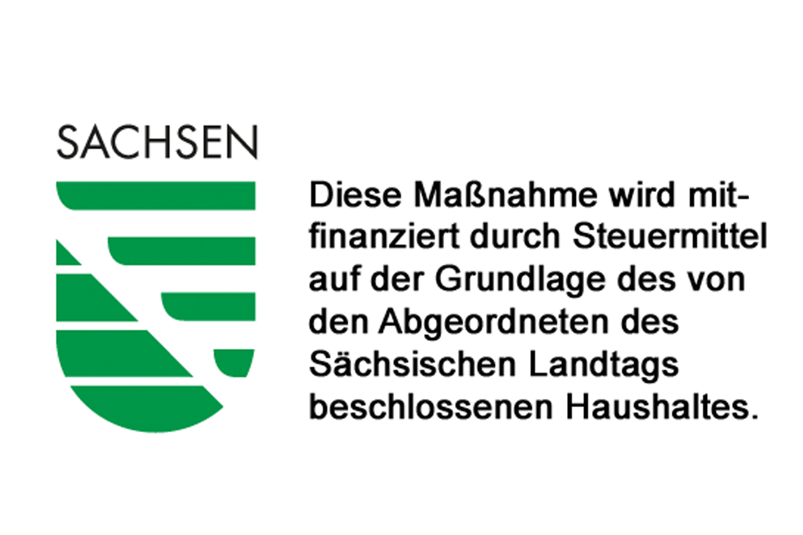
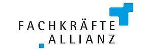
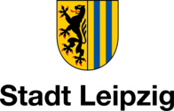

  Es handelt sich um ein Projekt der Fachkräfteallianz Leipzig, Nordsachsen und Leipziger Land.
  Das Projekt wird zudem unterstützt von der
  <a href="https://www.karl-kolle-stiftung.de/startseite">Karl-Kolle-Stiftung</a>
  sowie der
  <a href="https://eust-leipzig.eu">Stiftung Energie und Umwelt Leipzig</a>.

  

  
  
  
  

